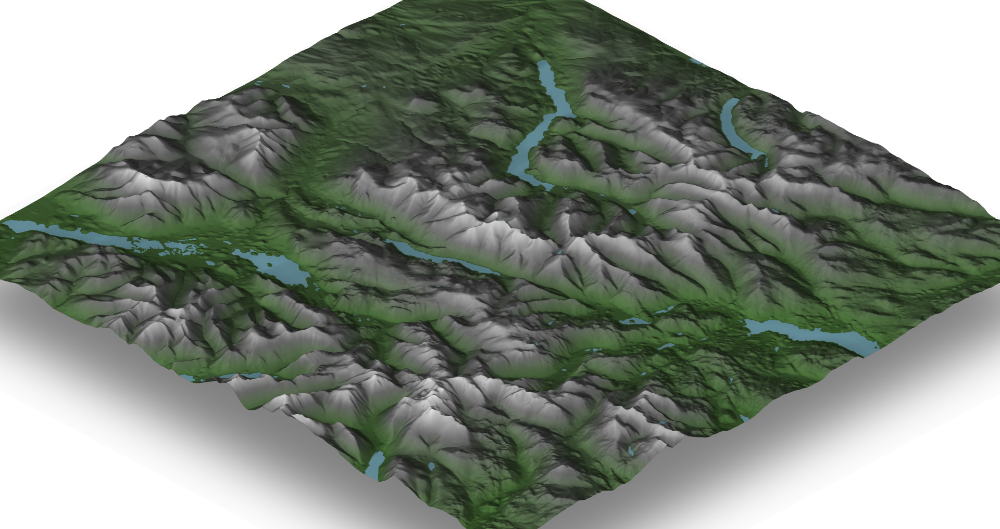

# Geoviz

Helper functions to draw [rayshader](https://github.com/tylermorganwall/rayshader) scenes.
- From UK OS Terrain 50 data
- With elevation shading (green valleys and snow capped peaks, or anything else you want)
- with added  GPS tracks

[Rayshader](https://github.com/tylermorganwall/rayshader) is an awesome bit of kit! I'm just doing some colouring in.

### Installing

```R
devtools::install_github("neilcharles/geoviz")
```

### Example

To draw scenes of UK geography using OS Terrain 50 data.

Download [OS Terrain 50](https://www.ordnancesurvey.co.uk/business-and-government/products/terrain-50.html) and unpack it so that you have a "data" directory.

```R
library(geoviz)
```

Stitch all of the GRID files together into a single raster of the entire UK. This will quite take some time! But it only needs to be done once and will save the raster it creates.

Point the mosaic_uk_grid() function at the "data" directory from your OS50 download and Include the trailing / in the path.

```R
mosaic_uk_grid("path/to/grid/data/")  #ONLY RUN THIS ONCE TO CREATE THE WHOLE UK MOSAIC RASTER. IT WILL BE SLOW.
```

Load the merged raster file

```R
raster_mosaic <- raster::raster("mosaic_uk_grid.grd")
```

Get lat long coordinates for a UK location. This is a spot in the middle of the Lake district.

```R
coords <- ggmap::geocode("wythburn, UK")
```

Crop a square around the coords location from the whole UK raster and render it as a rayshader scene

```R
square_km <- 10  #length of one side of the square to be cropped from the whole UK raster

raster_crop <- crop_raster_square(raster_mosaic, coords$lat, coords$lon, square_km)

r <- render_location(raster_crop)

rayshader::plot_3d(
  r$r,
  r$elmat,
  zscale = 50,
  shadow = TRUE
)
```



Don't close the 3D scene! We're going to add a GPS track to it.

Read an IGC tracklog file. If you just want an example file, you can download one [here](http://www.xcleague.com/xc/flights/2013554.html). Click the 'tracklog' button in the bottom left.

Alternatively use any source of decimal lat-long and altitude data that you like in the script below but you'll have to do your own transformation to get decimal lat-long and altitude from whatever format it's in.

```R
flight <- read_igc("CharlesN-2013-04-19.igc")

add_gps_to_rayshader(raster_crop, flight$lat, flight$long, flight$altitude, 50)
```


Note that if you want to centre the gps track, just average its lat-long points and use that location for crop_raster_square() instead of looking up a lat-long using geocode().
