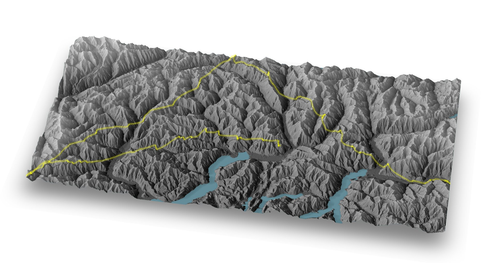
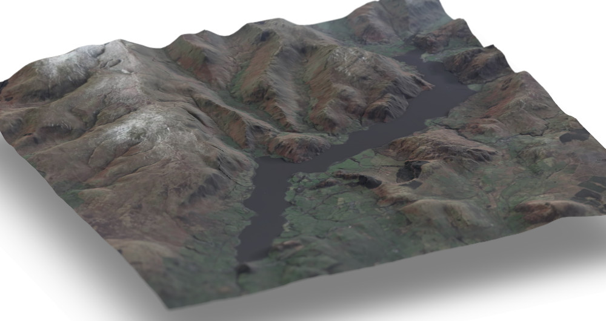
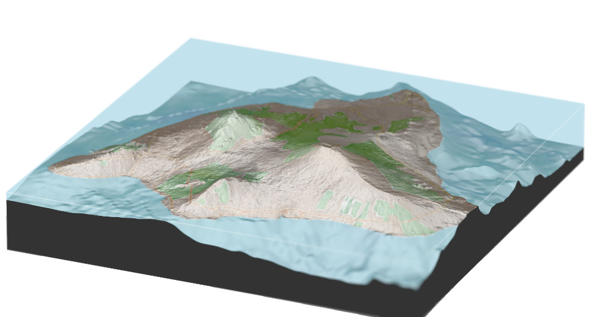
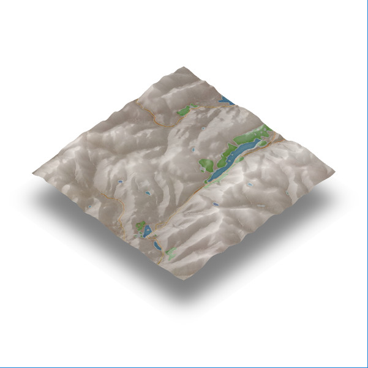
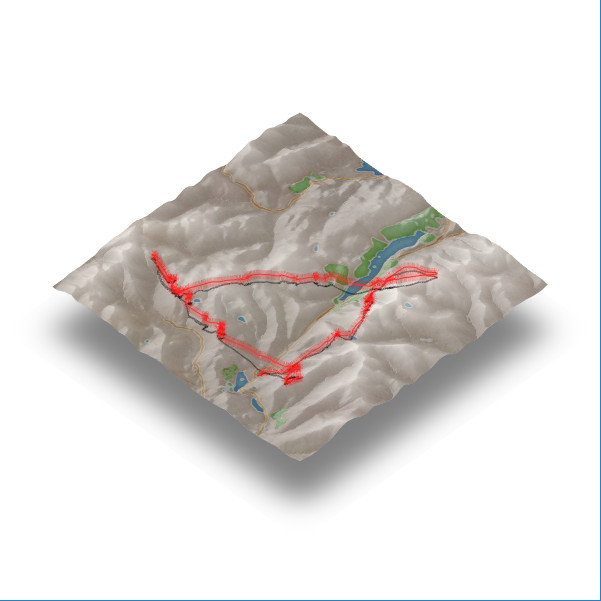
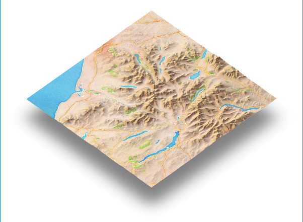

[](https://www.tidyverse.org/lifecycle/#maturing)
[](https://cran.r-project.org/package=geoviz)
# Geoviz

[](https://travis-ci.org/neilcharles/geoviz)

Helper functions to draw ['rayshader'](https://github.com/tylermorganwall/rayshader) scenes.
- Using elevation data from 'Mapzen' and 'Mapbox' 
- With map and satellite overlays
- Blending between different overlays at different altitudes
- with added  GPS tracks
- From EU Copernicus, NASA ASTER or any other DEM (Digital Elevation Model) data
- With elevation shading (green valleys and snow capped peaks, or anything else you want)

['Rayshader'](https://github.com/tylermorganwall/rayshader) is an awesome bit of kit! I'm just doing some colouring in.

### Installing

geoviz is on CRAN:

```R
install.packages("geoviz")
```

Or for the latest development version:

```R
devtools::install_github("neilcharles/geoviz")
```

Read [news](news.md) to understand the latest updates and bug fixes.

Geoviz helps you to draw images like these.








### Example

```R
library(geoviz)
library(rayshader)

#Load an example IGC (GPS track log) file

igc <- example_igc()

#Load a small example elevation raster showing a piece of the English Lake district

DEM <- example_raster()

sunangle = 270

zscale = 25

#Get a Stamen map that will cover our DEM

stamen_overlay <- slippy_overlay(DEM, image_source = "stamen", image_type = "watercolor", png_opacity = 0.3)

#Make an elevation shading layer with dark valleys and light peaks (not essential but I like it!)

elevation_overlay <- elevation_shade(DEM, elevation_palette = c("#000000", "#FFFFFF"), png_opacity = 0.6)


#Calculate the 'rayshader' scene (see 'rayshader' documentation)

elmat = matrix(
  raster::extract(DEM, raster::extent(DEM), method = 'bilinear'),
  nrow = ncol(DEM),
  ncol = nrow(DEM)
)

scene <- elmat %>%
  sphere_shade(sunangle = sunangle, texture = "bw") %>% 
  add_overlay(elevation_overlay) %>%
  add_overlay(stamen_overlay)


#Render the 'rayshader' scene

rayshader::plot_3d(
  scene,
  elmat,
  zscale = zscale,
  solid = FALSE,
  shadow = TRUE,
  shadowdepth = -100
)
```




```R

#Add the gps track

add_gps_to_rayshader(
  DEM,
  igc$lat,
  igc$long,
  igc$altitude,
  line_width = 1.5,
  lightsaber = TRUE,
  colour = "red",
  zscale = zscale,
  ground_shadow = TRUE
)


```



### Quick access to digital elevation model data

To draw scenes using sub 2m resolution DEM's, you'll need to download your own data (see below), but geoviz also has helpful functions to obtain DEM data from [Mapbox](https://docs.mapbox.com/help/troubleshooting/access-elevation-data/) and [Mapzen](https://www.mapzen.com/). Mapzen doesn't require an API key and gives access to higher resolution data, depending on where in the world you request.

```R

library(rayshader)
library(geoviz)

mapbox_key <- "YOUR MAPBOX KEY"

lat <- 54.4502651
long <- -3.1767946
square_km <- 20

#Get elevation data from Mapbox
dem <- mapbox_dem(lat, long, square_km, api_key = mapbox_key)

#Note: You can get elevation data from Mapzen instead, which doesn't require an API key.
#You'll still need an API key for any mapbox image overlays.
#Get a DEM from mapzen with:
#dem <- mapzen_dem(lat, long, square_km)

#Get an overlay image (Stamen for this example because it doesn't need an API key)
overlay_image <-
  slippy_overlay(dem, image_source = "stamen", image_type = "watercolor", png_opacity = 0.5)

#Optionally, turn mountainous parts of the overlay transparent
overlay_image <-
  elevation_transparency(overlay_image,
                        dem,
                        pct_alt_high = 0.5,
                        alpha_max = 0.9)


#Draw the 'rayshader' scene
elmat = matrix(
  raster::extract(dem, raster::extent(dem), method = 'bilinear'),
  nrow = ncol(dem),
  ncol = nrow(dem)
)

scene <- elmat %>%
  sphere_shade(sunangle = 270, texture = "desert") %>% 
  add_overlay(overlay_image)

rayshader::plot_3d(
  scene,
  elmat,
  zscale = raster_zscale(dem),
  solid = FALSE,
  shadow = TRUE,
  shadowdepth = -150
)
```



```R
# You can also visualise your data in ggplot2 rather than 'rayshader'.

gg_overlay_image <-
  slippy_overlay(
    dem,
    image_source = "stamen",
    image_type = "watercolor",
    return_png = FALSE
  )

ggplot2::ggplot() +
  ggslippy(gg_overlay_image)


```


### Handling digital elevation model data

DEM files can be downloaded from various sources, usually in .asc or .tif format. Often, they will be small files that need to be stitched together to render the scene that you want.

If you have downloaded a set of DEM files, use mosaic_files() to create a single raster for use with 'rayshader'. The mosaic_files() function is flexible and will accept a directory of files or zipped files, using any naming convention and file extension.

```R
mosaic_files(
  "path/to/zip/files",
  extract_zip = TRUE,
  file_match = ".*.TIF",
  raster_output_file = "mosaic_out.raster"
)

raster_mosaic <- raster::raster("mosaic_out.gri")
```

### DEM data sources

The following is by no means an exhaustive list of data sources, but it will get you started.


**EU Copernicus**

EU coverage.

Copernicus map tiles are large, typically 3-5GB each and covering a country sized area. Download [Copernicus](https://land.copernicus.eu/imagery-in-situ/eu-dem/eu-dem-v1.1?tab=mapview)

```R
zscale <- 25
```

**OS Terrain 50**

UK coverage. Copernicus also covers the UK and comes as a single file covering the whole UK if you want to use that instead.

Download [OS Terrain 50](https://www.ordnancesurvey.co.uk/business-and-government/products/terrain-50.html)

```R
mosaic_files(
  "path/to/zip/files",
  extract_zip = TRUE,
  zip_file_match = ".*GRID.*.zip"
  file_match = ".*.asc",
  raster_output_file = "mosaic_out.raster"
)

raster_mosaic <- raster::raster("mosaic_out.gri")

zscale <- 50
```

**NASA ASTER**

Whole world coverage but quite noisy. Copernicus is better if you're mapping in the EU.

Download [NASA Aster](https://search.earthdata.nasa.gov/search/granules?p=C197265171-LPDAAC_ECS&q=aster&ok=aster).
Search for "ASTER" in the top left box and select "ASTER Global Digital Elevation Model V002" underneath the map. You won't realistically be able to stitch together a single file of the whole world - it would be enormous - so just download the areas you need.

Stitching together the separate files is the same process as for OS Terrain 50.

```R
zscale <- 30
```


### Slicing pieces out of the DEM

You probably don't want to render everything in your DEM data, you'll want to cut out a piece. Geoviz has two functions to help you do this.

Crop out a square around a point...

```R

library(ggmap)

register_google(key = your_google_key)

#Note that the below will only work if you point it at DEM data that contains Keswick! 

coords <- geocode("Keswick, UK")

DEM <- crop_raster_square(big_DEM, coords$lat, coords$lon, square_km)
```

Or crop a section from your DEM to fit a GPS track...

```R

igc <- example_igc()

DEM <- crop_raster_track(example_raster(), igc$lat, igc$long, width_buffer = 2)
```

### Loading GPS tracks

You can load GPS track data any way that you like and pass decimal lat-longs as vectors to geoviz functions (see code examples above).

If your GPS data is in IGC format - commonly used for glider flight data - then geoviz has a function read_igc(), which will do all the formatting work for you.

If your GPS data is in .gpx format, the plotKML package has a handy function readGPX().

```R
igc <- read_igc("path/to/your/file.igc")
```

### Adding GPS traces to 'rayshader' scenes

Geoviz converts decimal lat-long GPS traces into the 'rayshader' coordinate system and then plots the GPS track using the function add_gps_to_rayshader(). Rather than adding a trace to a scene, if you just want to convert lat-long points into 'rayshader' coordinates and see the converted data (e.g. so you can add your own rgl shapes to the scene or for use with 'rayshder' render_label() function), use latlong_to_rayshader_coords().
